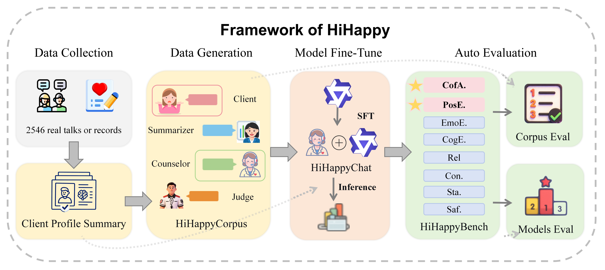
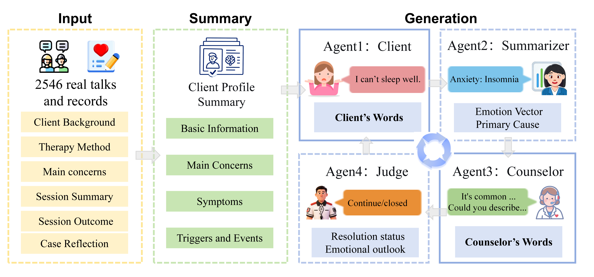

# HiHappy: 实现心理咨询中的共频能力

<div align="center">

[](https://www.python.org/downloads/)
[](https://pytorch.org/)
[](https://huggingface.co/transformers/)
[](https://www.deepspeed.ai/)
[](LICENSE)

**Choose your language**

[](README_ZH.md)
&nbsp;&nbsp;&nbsp;&nbsp;
[](README.md)

*基于大语言模型的心理咨询对话系统 - 实现情绪同频、根源挖掘*

</div>

---

## 📖 项目简介

### 背景与动机

心理咨询的核心在于建立有效的咨访关系，而**共频能力**是实现这一目标的关键。传统的心理咨询对话系统往往忽视了咨询师与来访者之间的情绪同步、沟通节奏匹配和隐性需求理解，导致对话质量不佳。

<!-- 
📸 图片位置1：项目概览图
文件名：assets/overview.png
说明：展示HiHappy系统的整体架构和核心功能
建议尺寸：1200x600px
-->
<div align="center">
  
  <p><i>图1: HiHappy心理咨询对话系统整体架构</i></p>
</div>

本项目实现了论文《HiHappy: Achieving Co-frequency Alignment and Positive Emotional Shift in Psychological Counseling LLMs》中提出的创新方法，通过以下技术突破解决了这些问题：

1. **多维度评估体系**：建立了包含8个核心维度的心理咨询对话评估框架
2. **四LLM协同生成**：创新性地使用咨询师、来访者、总结师、评估师四个模型协同生成高质量训练数据
3. **动态策略调整**：基于实时情绪分析动态调整咨询策略和节奏
4. **专业技术融合**：整合REBT、CBT、人本主义等多种心理咨询技术

### 核心能力

本系统通过微调大语言模型（Qwen3-8B），实现了以下心理咨询核心能力：

| 能力维度 | 具体表现 | 技术实现 |
|---------|---------|---------|
| **共频能力** | 精准捕捉来访者情绪状态、匹配沟通节奏、尊重边界需求、理解隐性需求 | 四维度评估（情绪捕捉40% + 沟通节奏30% + 边界尊重20% + 隐性需求10%） |
| **关系建立** | 构建安全、信任、协作、稳定的咨访关系 | 信任构建、接纳安全感、互动适配、真诚度评估 |
| **对话策略** | 采用适配的心理咨询技术（REBT、CBT、人本主义、SFBT、EFT等） | 策略适配性、有效性、灵活性、伦理合规性 |
| **情感共情** | 感受并回应来访者的情绪体验 | 情感觉察、回应适配、共鸣深度、无侵入性 |
| **情绪改善** | 有效缓解来访者的消极情绪，提升积极情绪 | 情绪变化趋势、改善幅度、稳定性评估 |
| **认知共情** | 理解来访者的想法、观点和认知模式 | 观点理解、认知重构、引导效果 |
| **状态态度** | 保持专业、稳定、积极的咨询状态 | 专业性、稳定性、积极性评估 |

### 2. 高质量数据生成机制

#### 2.1 四LLM协同生成架构

<!-- 
📸 图片位置3：三LLM协同架构图
文件名：assets/three-llm-architecture.png
说明：展示咨询师、来访者、总结师、判断师四个模型的协同工作流程
建议尺寸：800x1000px（竖向）
提示：可以从论文中提取相关架构图，或使用draw.io重新绘制
-->
<div align="center">
  
  <p><i>图3: 四LLM协同生成架构 - 咨询师、来访者、总结师、评估师四模型协同工作</i></p>
</div>

总结师模型会分析来访者的情绪状态，输出七维情绪向量：

```python
情绪向量 = [
    开心: 0.15,        # 积极情绪
    平静: 0.70,        # 积极情绪
    焦虑: 0.30,        # 消极情绪
    悲伤: 0.10,        # 消极情绪
    愤怒: 0.05,        # 消极情绪
    内疚/羞耻: 0.10,   # 消极情绪
    无助/绝望: 0.05    # 消极情绪
]
```

**情绪成因分析**：
- **积极情绪产生原因**：因咨询师共情式回应认可了其照顾家人的付出，感受到被理解，平静感有所提升
- **消极情绪产生原因**：因长期照顾患病家人导致睡眠不足，且担心自身健康状况，产生持续的焦虑和轻微无助感


### 3. 模型训练优化

#### 3.1 LoRA高效微调

**LoRA配置详解**：

```python
config = LoraConfig(
    task_type=TaskType.CAUSAL_LM,  
    target_modules=[
        "q_proj",      # Query投影层
        "k_proj",      # Key投影层
        "v_proj",      # Value投影层
        "o_proj",      # Output投影层
        "gate_proj",   # FFN门控层
        "up_proj",     # FFN上投影层
        "down_proj"    # FFN下投影层
    ],
    
    inference_mode=False,  # 训练模式
    r=16,                  # LoRA秩（rank）
    lora_alpha=32,        # LoRA缩放因子
    lora_dropout=0.05,    # Dropout比例
)
```


#### 3.2 DeepSpeed分布式训练

**ZeRO-2优化策略**：

```json
{
  "zero_optimization": {
    "stage": 2,
    "offload_optimizer": {
      "device": "cpu",
      "pin_memory": true
    },
    "offload_param": {
      "device": "cpu",
      "pin_memory": true
    },
    "allgather_partitions": true,
    "allgather_bucket_size": 2e8,
    "overlap_comm": true,
    "reduce_scatter": true,
    "reduce_bucket_size": 2e8,
    "contiguous_gradients": true
  },
  "gradient_accumulation_steps": 8,
  "gradient_clipping": 1.0,
  "train_batch_size": "auto",
  "train_micro_batch_size_per_gpu": "auto",
  "wall_clock_breakdown": false
}
```

## 🚀 快速开始

#### 软件要求

```bash
操作系统: Linux (Ubuntu 20.04+推荐)
Python: 3.8 - 3.11
CUDA: 11.8 或 12.1
cuDNN: 8.6+
```

### 环境安装

#### 方法1：使用Conda（推荐）

```bash
# 1. 创建虚拟环境
conda create -n hihappy python=3.10
conda activate hihappy

# 2. 安装PyTorch（根据CUDA版本选择）
# CUDA 11.8
conda install pytorch==2.1.0 torchvision==0.16.0 torchaudio==2.1.0 pytorch-cuda=11.8 -c pytorch -c nvidia

# 3. 克隆仓库
git clone https://github.com/yourusername/HiHappy.git
cd HiHappy

# 4. 安装依赖
pip install -r requirements.txt

# 5. 安装DeepSpeed
pip install deepspeed

# 6. 验证安装
python -c "import torch; print(f'PyTorch: {torch.__version__}'); print(f'CUDA Available: {torch.cuda.is_available()}')"
```

## 🔧 模型训练

### 方法1：使用提供的训练脚本

```bash
# 单卡训练
python train_Q3-8b.py

# 多卡训练（使用DeepSpeed）
CUDA_VISIBLE_DEVICES=0,1,2,3 deepspeed --num_gpus=4 train_Q3-8b-Emo+four_data.py
```

**训练配置说明**：

编辑 `train_Q3-8b.py` 修改以下配置：

```python
# 模型路径
model_name = "/path/to/Qwen3-8B-Instruct"

# 数据集路径
data_files = [
    "/path/to/train_data.json",
]

# 输出路径
output_dir = "/path/to/output/lora_model"

# GPU配置
os.environ["CUDA_VISIBLE_DEVICES"] = "0,1,2,3"
```

### 方法2：使用LLaMA-Factory训练（推荐）

本项目提供了完整的 LLaMA-Factory 配置文件 `training_args.yaml`，可以直接使用 LLaMA-Factory 进行训练。

#### 安装LLaMA-Factory

```bash
git clone https://github.com/hiyouga/LLaMA-Factory.git
cd LLaMA-Factory
pip install -e .
```

#### 配置数据集

在 `LLaMA-Factory/data/dataset_info.json` 中添加你的数据集：

```json
{
  "my_counseling_data": {
    "file_name": "/path/to/your/train_data.json",
    "formatting": "sharegpt",
    "columns": {
      "messages": "messages"
    }
  }
}
```

#### 使用配置文件训练

```bash
# 复制配置文件到LLaMA-Factory目录
cp training_args.yaml LLaMA-Factory/

# 启动训练
cd LLaMA-Factory
llamafactory-cli train training_args.yaml
```

**配置文件说明** (`training_args.yaml`)：

```yaml
# 模型配置
model_name_or_path: /path/to/Qwen3-8B-Instruct
output_dir: saves/Qwen3-8B-Instruct/lora/train

# 训练参数
per_device_train_batch_size: 1
gradient_accumulation_steps: 8
learning_rate: 5.0e-05
num_train_epochs: 2.0

# LoRA配置
finetuning_type: lora
lora_rank: 8
lora_alpha: 16
lora_target: all

# DeepSpeed配置
deepspeed: ds_z2_offload_config.json

# 数据集配置
dataset: my_counseling_data
dataset_dir: data
cutoff_len: 8192
```

### 训练监控

训练过程会自动记录到 SwanLab，访问 https://swanlab.cn 查看：
- Loss曲线
- 学习率变化
- GPU利用率
- 训练速度

## 📊 模型评估

训练完成后，可以使用项目提供的评估脚本对模型进行全面评估。

### 评估维度

本项目提供7个核心维度的评估脚本：

| 评估维度 | 脚本文件 | 说明 |
|---------|---------|------|
| 共频能力 | `model_evaluation/cofrequency_evaluation.py` | 评估情绪捕捉、沟通节奏、边界尊重、隐性需求理解 |
| 关系建立 | `model_evaluation/relationship_evaluation.py` | 评估信任构建、安全感营造、接纳表达 |
| 对话策略 | `model_evaluation/strategy_evaluation.py` | 评估REBT、CBT等心理咨询技术的应用 |
| 情感共情 | `model_evaluation/emotional_empathy_evaluation.py` | 评估情感觉察、回应适配、共鸣深度 |
| 情绪改善 | `model_evaluation/emotion_improvement_evaluation.py` | 评估情绪变化趋势、改善幅度、稳定性 |
| 认知共情 | `model_evaluation/cognitive_empathy_evaluation.py` | 评估观点理解、认知重构、引导效果 |
| 状态态度 | `model_evaluation/state_attitude_evaluation.py` | 评估专业性、稳定性、积极性 |

### 运行评估

#### 1. 启动模型推理服务

首先需要启动vLLM推理服务：

```bash
# 启动vLLM服务（使用训练好的模型）
python -m vllm.serve.openai \
    --model /path/to/your/finetuned/model \
    --port 6006 \
    --gpu-memory-utilization 0.9
```

#### 2. 运行单个维度评估

```bash
# 评估共频能力
python model_evaluation/cofrequency_evaluation.py

# 评估情感共情
python model_evaluation/emotional_empathy_evaluation.py

# 评估其他维度...
```

#### 3. 批量评估所有维度

```bash
# 依次运行所有评估脚本
for script in model_evaluation/*_evaluation.py; do
    python "$script"
done
```

#### 4. 计算综合得分

```bash
# 计算所有维度的平均分数
python model_evaluation/calculate_average_score.py
```

### 评估配置

在运行评估前，需要修改各评估脚本中的配置项：

```python
# 配置项示例
VLLM_BASE_URL = "http://localhost:6006/v1"  # vLLM服务地址
VLLM_MODEL_NAME = "/path/to/your/model"     # 模型路径
DATASET_PATH = "/path/to/test_data.json"    # 测试数据集路径
OUTPUT_PATH = "/path/to/output/results.json" # 结果输出路径
MAX_CONCURRENCY = 10                         # 最大并发数
```

### 数据集评估

如果需要评估训练数据集的质量，可以使用 `dataset_evaluation/` 文件夹中的脚本：

```bash
# 评估数据集的共频能力标注质量
python dataset_evaluation/cofrequency_evaluation.py

# 评估其他维度...
```

### 评估结果

评估完成后，会生成JSON格式的结果文件，包含：
- 每个样本的详细得分（0-3分）
- 评估分析说明
- 平均得分统计
- 成功率统计

示例输出：
```json
[
  {
    "样本ID": "sample_001",
    "对话ID": "dialog_001",
    "轮次号": 1,
    "共频能力得分": 3,
    "分析": "模型精准捕捉了来访者的焦虑情绪..."
  }
]
```

## 📝 论文

如果你使用了本项目的代码或方法，请引用我们的论文：

```bibtex
@article{hihappy2024,
  title={HiHappy: Achieving Co-frequency in Psychological Counseling},
  author={Your Name},
  journal={arXiv preprint arXiv:XXXX.XXXXX},
  year={2024}
}
```

## 🤝 贡献

欢迎提交 Issue 和 Pull Request！

### 贡献指南

1. Fork 本仓库
2. 创建特性分支 (`git checkout -b feature/AmazingFeature`)
3. 提交更改 (`git commit -m 'Add some AmazingFeature'`)
4. 推送到分支 (`git push origin feature/AmazingFeature`)
5. 开启 Pull Request

## 📄 许可证

本项目采用 MIT 许可证 - 详见 [LICENSE](LICENSE) 文件


## 📚 参考资料

### 论文

- [HiHappy: Achieving Co-frequency in Psychological Counseling](984_HiHappy_Achieving_Co_frequ%20(3).pdf)

### 相关工作

- **心理咨询理论**：
  - Ellis, A. (1962). Reason and emotion in psychotherapy. (REBT理论)
  - Beck, A. T. (1979). Cognitive therapy and the emotional disorders. (CBT理论)
  - Rogers, C. R. (1951). Client-centered therapy. (人本主义理论)

- **大语言模型**：
  - Qwen Team. (2024). Qwen2.5 Technical Report.
  - Hu, E. J., et al. (2021). LoRA: Low-Rank Adaptation of Large Language Models.

- **心理咨询对话系统**：
  - Liu, Z., et al. (2021). Towards Empathetic Open-domain Conversation Models.
  - Sharma, A., et al. (2020). A Computational Approach to Understanding Empathy.


## 📄 许可证

本项目采用 MIT 许可证 - 详见 [LICENSE](LICENSE) 文件

```
MIT License

Copyright (c) 2024 HiHappy Team

Permission is hereby granted, free of charge, to any person obtaining a copy
of this software and associated documentation files (the "Software"), to deal
in the Software without restriction, including without limitation the rights
to use, copy, modify, merge, publish, distribute, sublicense, and/or sell
copies of the Software, and to permit persons to whom the Software is
furnished to do so, subject to the following conditions:

The above copyright notice and this permission notice shall be included in all
copies or substantial portions of the Software.

THE SOFTWARE IS PROVIDED "AS IS", WITHOUT WARRANTY OF ANY KIND, EXPRESS OR
IMPLIED, INCLUDING BUT NOT LIMITED TO THE WARRANTIES OF MERCHANTABILITY,
FITNESS FOR A PARTICULAR PURPOSE AND NONINFRINGEMENT. IN NO EVENT SHALL THE
AUTHORS OR COPYRIGHT HOLDERS BE LIABLE FOR ANY CLAIM, DAMAGES OR OTHER
LIABILITY, WHETHER IN AN ACTION OF CONTRACT, TORT OR OTHERWISE, ARISING FROM,
OUT OF OR IN CONNECTION WITH THE SOFTWARE OR THE USE OR OTHER DEALINGS IN THE
SOFTWARE.
```


## 📊 项目统计


---

<div align="center">

**⭐ 如果这个项目对你有帮助，请给我们一个 Star！⭐**

**让AI更懂人心，让心理咨询更有温度**

Made with ❤️ by HiHappy Team

[返回顶部](#hihappy-实现心理咨询中的共频能力)

</div>
